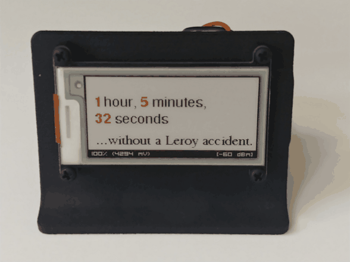
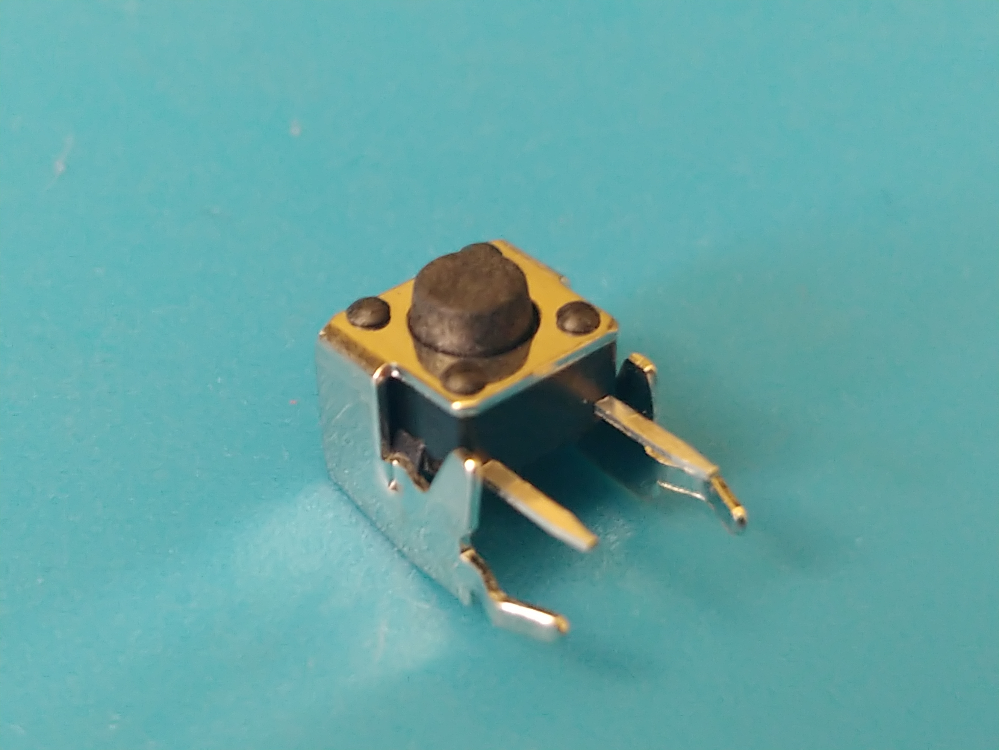
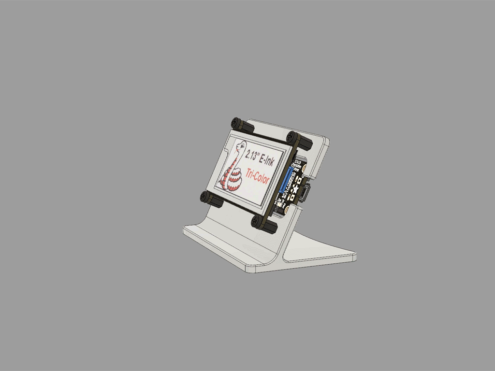

# DoggieClock
In the style of a "Days since last accident..." factory safety sign, DoggieClock tracks the time since our puppy's last accident.

Or you can modify the code and track the passage of time for any event you desire.

My motivation for this project was mainly to experiment with tri-color ePaper displays (EPDs) and an ESP32.  ePaper/eInk displays are perfect for this type of project because they only draw power when updating the screen, and paired with ESP32 low-power modes, the project should be able to run for a quite a bit on just a LiPo battery.

...And my other motivation was of course, Leroy, this little gremlin right here:

# Setup

## Hardware

### [Adafruit HUZZAH32 – ESP32 Feather Board](https://www.adafruit.com/product/3405)
Everything you could want in an ESP32 board and then some.  WiFi and Bluetooth support, USB-to-serial converter, LiPo charger circuit, 4MB of flash, multiple ADC/DAC, I2C/SPI/UART, and plenty of GPIO.

This project uses stacking headers, so get that variation from Adafruit or buy the stacking headers separately and solder yourself.

The Feather Board form factor breaks everything out for easy debugging and prototyping, and is compatible with a range of pre-existing FeatherWing boards, such as...

### [Adafruit 2.13" Tri-Color eInk / ePaper Display FeatherWing - Red Black White](https://www.adafruit.com/product/4128)
This is a tri-color eInk display (red/white/black).  I didn't even know that was a thing before this project, but I knew I had to try one.

Adafruit makes it too easy with added SRAM, a microSD socket, and integrated support with their GFX libraries.  I've spent a lot of time on past projects managing font glyphs and image bitmaps, but not with this board.

They also offer a traditional monochrome eInk version of this board, and this project code should support it as well.  Look for the `EPD_MONOCHROME` flag.

### [Lithium Ion Polymer Battery - 3.7v 1200mAh](https://www.adafruit.com/product/258)
You can go with more or less mAh as your needs require.  If you don't get it from Adafruit, check the polarity of your connector to make sure it's the same as the board, or you'll let out the magic smoke.  You can also forego the LiPo altogether and run the board off USB power alone.

### Reset Button
You'll want to wire a button between GND and Pin 14 for the reset functionality.  The code is set up such that a short press will wake the device from sleep or restart the program if already awake, and a long press (configurable, default 10 seconds) will reset the counter.

I used a [Momentary Right Angle Tactile Switch](https://www.amazon.com/uxcell-Momentary-Tactile-Button-Switch/dp/B008420Z9W/ref=sr_1_4?dchild=1&keywords=tactile+momentary+switch+right+angle&qid=1594523931&sr=8-4) like the one pictured below, but any momentary button should do.

To keep a neat/tidy package, I used the right-angle mount tactile momentary button on a [FeatherWing Proto Board](https://www.adafruit.com/product/2884).  Sure it's overkill, but the FeatherWing ecosystem made it too easy and it makes the final product looks nice.

### [3D Printed Display Stand/Housing](https://learn.adafruit.com/eink-featherwing-display-stand?embeds=allow)
Adafruit pulls through once again with a nice little stand design that fits the eInk board perfectly.  They don't sell this one but the STL is free to download.  If you're into 3D printing like me, give printing one a shot.  Or send the STL to somewhere like Shapeways and have them print it for you.

Some [nylon screws and standoffs](https://www.adafruit.com/product/3299) pull it all together and make the thing look damn-near professional.

## Software

### Arduino IDE
Header over to [the official Arduino site](https://www.arduino.cc/en/Main/Software) and follow their steps for downloading/installing the Arduino IDE for your OS.

### ESP32 Drivers and IDE Configuration
Carefully, follow the steps on [this Adafruit tutorial](https://learn.adafruit.com/adafruit-huzzah32-esp32-feather/using-with-arduino-ide) to get setup with your board.  It should guide you (or provide links) to add Espressif's board repository to your Arduino IDE, download the SiLabs USB-UART driver, and configure the IDE for your board.

### Libraries
This project is dependent on the following libraries.  To add them to your project go to `Tools -> Manage Libraries` and search for these library names:

* Adafruit EPD
* Adafruit GFX Library
* Adafruit BusIO
* ArduinoJson
* Time

### DoggieClock Configuration

#### WiFi
DoggieClock utilizes ESP32's WiFi to network with a time server to obtain timestamps.  You'll need to create a file called **secrets.h** that contains `#defines` for `WIFI_SSID` and `WIFI_PASSWORD`.  See **example-secrets.h** for details.

#### User Preferences
In **doggieclock.ino**, you'll find a few `#defines` for user-configurable items, e.g. `EPD_TRICOLOR/EPD_MONOCHROME`, `DEFAULT_SLEEP_SEC`, `RESET_BUTTON_HOLD_SEC`, `WIFI_TIMEOUT_SEC`, and `SUBTITLE_TEXT`.  Feel free to set these according to your preferences.

#### Compile and Run
That should be all there is to it.

# If you enjoyed this project...
Please donate to and buy from open source projects.  Open source doesn't just enable the fun little stuff like this.  It underpins most of the technologies we take for granted in our day to day lives.  While these things may be free to us, the cost to build and operate them is certainly not zero.  The communities from all over the globe that collaborate and share and learn with/from each other in order to build these projects deserve our support.

#### BUY
* [Adafruit](https://www.adafruit.com/)

* [Sparkfun](https://www.sparkfun.com/)

* [Espressif](https://www.espressif.com/)

#### DONATE
* [Arduino](https://www.arduino.cc/en/Main/Donate)

* [Mozilla Foundation](https://foundation.mozilla.org/en/)

* [Wikimedia Foundation](https://wikimediafoundation.org/support/)

* [Open Source Hardware Association](https://www.oshwa.org/)

* [Open Source Initiative](https://opensource.org/)

* [Software Freedom Conservancy](https://sfconservancy.org/)

